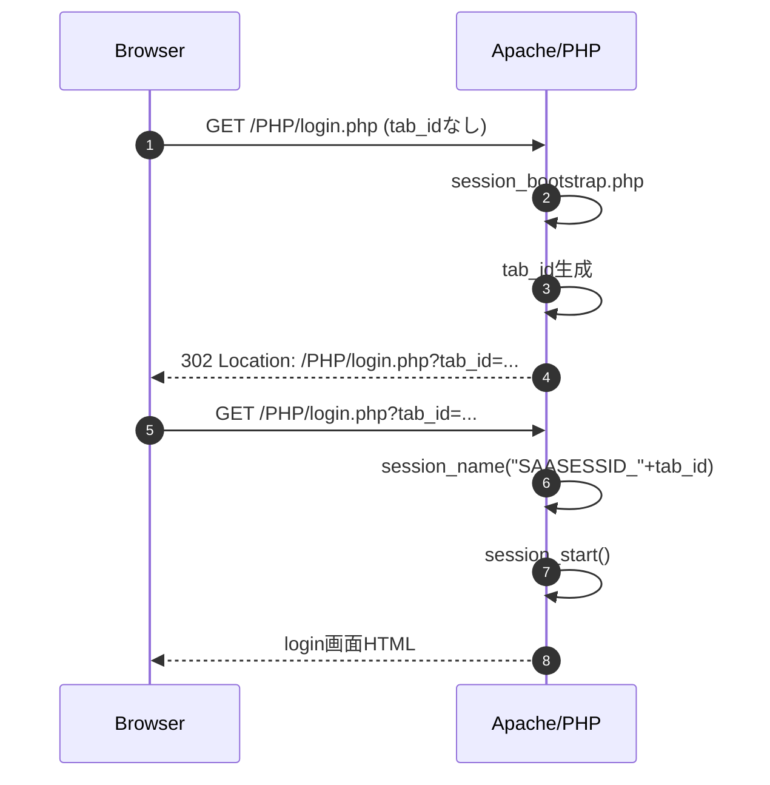
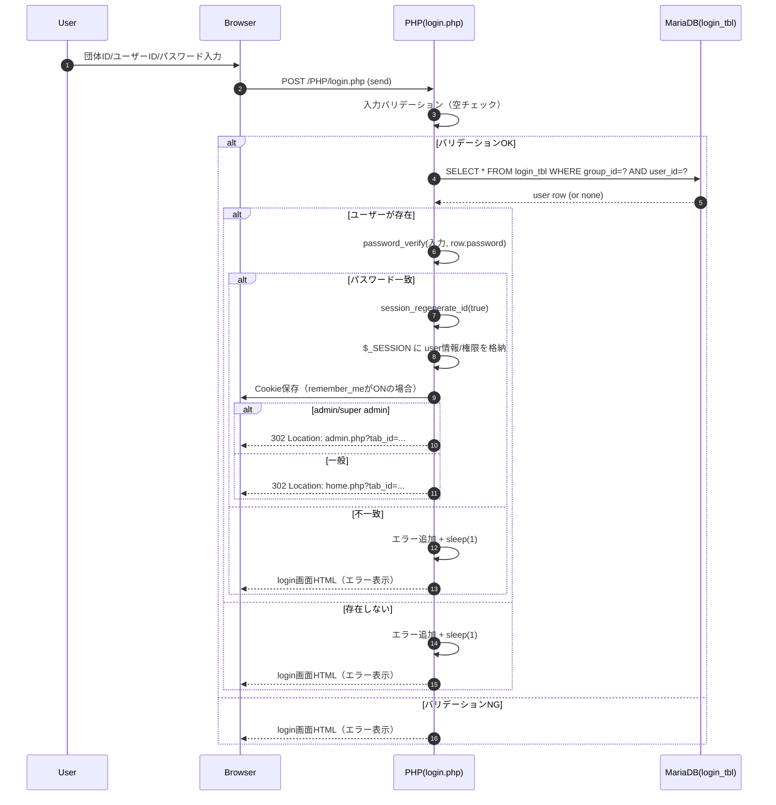
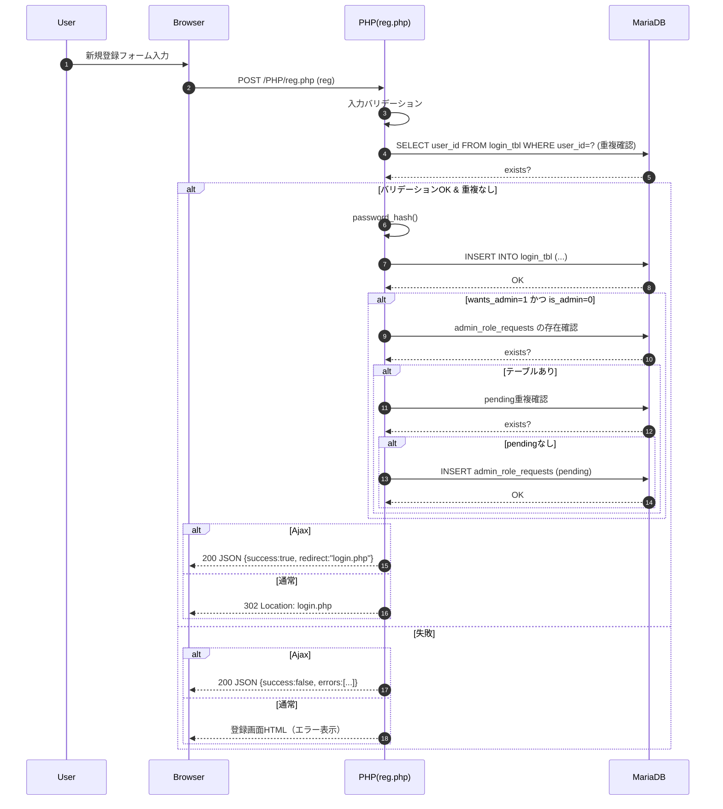

# ログイン・新規登録 処理フロー（シーケンス）

更新日: 2026-02-25

この資料は、実装（PHP/DB）に合わせてログインと新規登録の処理順序を図示する。

## 1. セッション開始（tab_id ブートストラップ）
- 対象: `PHP/session_bootstrap.php`
- 目的: URLクエリ `tab_id` を元に `session_name` を切り替え、タブ単位でセッションを分離する。

## 2. ログイン処理
- 対象: `PHP/login.php`
- 参照: `login_tbl`

## 3. 新規登録処理
- 対象: `PHP/reg.php`
- 更新: `login_tbl`
- 追加（任意）: `admin_role_requests`（管理者権限申請テーブルが存在する場合）

## 4. 画面遷移メモ（報告書向け）
- login.html.php から reg.php への導線は `tab_id` を引き継ぐ。
- reg.html.php の「ログインに戻る」は tab_id を明示的に引き継がないが、login.php 側で tab_id が無い場合は自動付与・リダイレクトされる。
